<h1 align="center">🌱🤖Automated Line-Painting Robot🤖🌱</h1>

 A mechatronics engineering project focused on the precise marking of grass fields using an autonomous robot 

   

## 📌Introduction:
Field marking in football pitches is a time-consuming and precision-critical task. Traditional methods require manual measurement, steady handling, and several hours of labor.

Our bussiness, BOTMARK, proposes the design and development of a reduced-scale autonomous robot capable of navigating a football field and painting regulation-compliant lines using integrated positioning, sensing, and control systems. 

The goal is to combine:
- Mechanical robustness  
- Accurate dispensing mechanisms  
- Autonomous path execution  

## 🏅Objectives:
The main objective is to design and build an autonomous robotic platform capable of marking the lines of a grass field with high precision and minimal human intervention.

### Specific Goals
To achieve this, we will fulfill the following requirements:
| Feature | Description |
|---------|-------------|
| 🔍 Localization | Integration of reliable positioning systems (Odometry + Lidar) |
| 🛞 Mobility | Chassis suitable for outdoor use |
| 🎯 Precision | Precise paint application mechanism |
| 🤖 Autonomy | Automated painting sequences |
| 📱 Control | Mobile application for supervision |

## 📁 Repository Structure

  
🖼️ <b>assets</b>

  <ul>
    <li>Contains all the <b>media</b> and <b>images</b> for the this README.</li>
  </ul>

  
💡 <b>electronics</b>

  <ul>
    <li>Contains all the electronic circuit designs, <b>PCB layouts</b>, <b>Schematics</b>, and <b>Gerber files</b> necessary for board manufacturing.</li>
  </ul>

  
🔩 <b>mechanics</b>

  <ul>
    <li>Contains the mechanical plans, source <b>CAD files</b>, and ready-to-print <b>STL files</b> for the chassis, wheels, and sand funnel mechanisms.</li>
  </ul>

  
📱 <b>web_app</b>

  <ul>
    <li>Contains the application code for the <b>user interface</b> and remote supervision of the robot.</li>
  </ul>

  
🤖 <b>robot_coding</b>

  <ul>
    <li>Central repository containing the complete codebase for the autonomous robot, from low-level microcontroller firmware to high-level ROS 2 navigation and networking.</li>
  </ul>
  
  <blockquote>
  

    
👾 <b>firmware</b> <i>(ESP32)</i>

    <ul>
      <li>ESP32 PlatformIO project containing the low-level C/C++ programming.</li>
      <ul>
      <li><b>lib/:</b> Custom libraries for hardware control (Encoders, IMU, Kinematics, Motors, PID, Zenoh).</li>
      <li><b>src/:</b> Main execution loop (<code>main.cpp</code>).</li>
      </ul>
    </ul>
  

  

    
🧠 <b>ros2_ws</b> <i>(High-Level Logic & ROS 2)</i>

    <ul>
      <li>ROS 2 workspace responsible for high-level processing, autonomous navigation, sensor data handling, and DDS communication.</li>
      <ul>
        <li><b>mission_manager/:</b> Python package handling navigation sequences. Includes a <code>config/</code> folder with the route YAML.</li>
        <li><b>controller_pkg/:</b> C++ package for managing the robot's control loop and odometry.</li>
        <li><b>ldlidar_stl_ros2/:</b> Node driver for the Lidar sensor (<a href="https://github.com/ldrobotSensorTeam/ldlidar_stl_ros2.git" target="_blank">provided by manufacturer</a>).</li>
        <li><b>obstacle_detector/:</b> C++ package for Lidar data processing and collision avoidance.</li>
        <li><b>zenoh_bridge/:</b> C++ package for DDS communication with the microcontroller.</li>
        <li><b>robot_bringup/:</b> Python package containing the launch file (<code>launch/robot_core.launch.py</code>) to start the entire system.</li>
      </ul>
    </ul>
  

  

    
🔌 <b>udev & zenoh_router</b>

    <ul>
      <li><b>udev/:</b> Linux rules (<code>99-robot.rules</code>) for stable USB sensor and motor connections.</li>
      <li><b>zenoh_router_v1.8.0/:</b> Router setup and configuration for Zenoh communications.</li>
    </ul>
  

  </blockquote>

  
⚙️ <b>Environment Setup</b>

  <ul>
    <li><b>setup_env.sh:</b> Bash script to quickly configure the development environment and dependencies.

## 🛠️ Bill of Materials (BOM)

| 📸 Image | Component | Quantity | Current Unit Price [€] | Current Cost [€] | Provider |
| :---: | :--- | ---: | ---: | ---: | :--- |
| 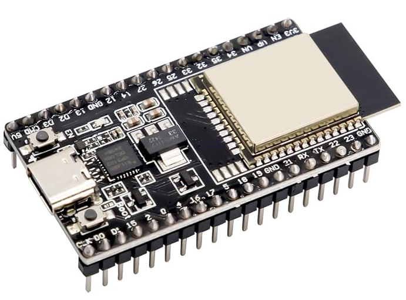 | ESP32 | 1 | 13.99 | 13.99 | <a href="https://www.amazon.es/-/en/Diymore-Nodemcu-Development-NodeMCU-Bluetooth/dp/B0D9BTQRYT/ref=sr_1_5?dib=eyJ2IjoiMSJ9.Ih_iW1U9Yuolk71YQpC7snteFtwVi5lqQbRQnU_btyEvpGZEjtdbNZqTeeak6xwmLTuzDwUbeX93HICeHCqPjAVBFAW4zTwTZfloko5QwF-qHzUTfsVnOY1Kh_-zBWA2V-s4N-IscSEmOJ2tJKrJjvBqytFbXJV8jS57ifrvFMXlqZDKJMtdTijbSUASK6YM4s67Oe4EDcr79hLMW3ZbMF0krRsoVipx-hvdUrK52TGUbiU9K40t_p17p5F-ZqS7LNM1PgTCq-vMkrolUvc8WI8YPvDMTkL0OtiPOwk_cDU.RHf99quLegPD1KPHYP98zduKh0GwWlBH5-uL-8fry1g&dib_tag=se&keywords=esp32&qid=1780855630&s=electronics&sr=1-5&th=1" target="_blank"> Amazon </a> |
| 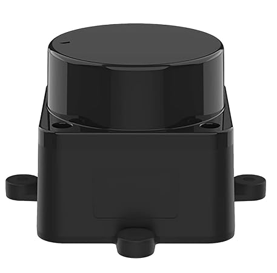 | Lidar sensor | 1 | 71.99 | 71.99 | <a href="https://www.amazon.es/-/en/Kit-12m-Distance-Intelligent-Manufacturer/dp/B0B1VD2PJH/ref=sr_1_3?crid=1LB9Q28WJF6OQ&dib=eyJ2IjoiMSJ9.mVqAi22igWgMu4pHd6JW0dpgfK2vzQmXVurvhzKGhsLfxc0p85nXcmaVe2RT-uC7dcVLZOM9eDQRxsSCeX506Rdelmtpp7PHvYk22i0QDBSgR4xuA1YcGTfWRGI8aXIsruEUI8uk3_L0jR9bSPxbL5Jm51SdxKr9Fn3fFhEkmQr3HTf5OWnxLOtYQ71ciGGpSesi2qCz9l70o3SesERefPnLdpJAcWh5plVjVxr9fuP7YwG54aasZsiiJn0iK2ur8zotBJI97psNT9D02sl7xgeEILxW9phJlPaMu9yt2SI.wkX3zwalqIfZuJAPH67J1HulmUV8gPN4qIPPeBmv-CE&dib_tag=se&keywords=lidar+ld19&qid=1780856393&sprefix=lidar+ld19%2Caps%2C120&sr=8-3" target="_blank"> Amazon </a> |
| 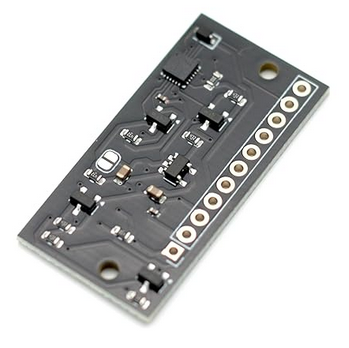 | IMU ICM-20948 | 1 | 12.87 | 12.87 | <a href="https://www.amazon.es/-/en/Minflora-S6O8295TO4805BSRUM39I50V6/dp/B0H35S3NCC/ref=sr_1_3?crid=3SZT0ME9OEF9J&dib=eyJ2IjoiMSJ9.Bsx9rbr3bdyMuQFMeJfI4aGGW6BpDkujC-Wa9K555Oo90H0WDC9C-5qiREat5_K25lFFZ-t8Yal6acSFWY8Fluh32MxtvZ9Ia3BbHNmiMwiZgv6sE9xA76s5HL5N-vnEhzhkbi_hl0JkTwe1wCy3v5uFUkT7_4Zj8EM30cUvDipnJQwzC-WddeidMcYTzcyCKBVCMWdnBSdvBfdh4jV6GUUVyYJ7BgbBmhcQndh5n3KivpOQzzqiQ6PwsH9uBVhhSKbVDeIYwaRmrh4bwSkFtMaMePTvVA3bQu5wYEkgSmw.Ngp2RGMCL0-e8JYHkDmUt_W-iFJhzqHlJ70FJsRX8ds&dib_tag=se&keywords=IMU+ICM-20948&qid=1780856563&sprefix=imu+icm-20948%2Caps%2C141&sr=8-3" target="_blank"> Amazon </a> |
| 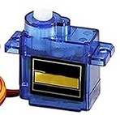  | 90g Servomotor | 1 | 2.2 | 2.2 | <a href="https://www.amazon.es/-/en/Walking-Helicopter-Airplane-Vehicle-Compatible/dp/B0F1CQTQ31/ref=sr_1_8?crid=2ZCB7XI6GHVG2&dib=eyJ2IjoiMSJ9.11RiV5vSOabnAQtb_Qrzi_Eyl4goBZORUM4wxNBEVUvqpH_ZPR4kq9v_0E2_MAfj1a_FtvQ4p4GyaaDDJlKS3VVFLbiEr4N3AudcuIjQb2RnpJzBoAJaJLXRMYShAiuyzeXxYnZOAbRlZfZYo3lTpr5LpUOX26KrtftFfSTCBS5s1-Ldn1f1EH_gJqzexuEUVgu592fP7bVFcohZ8v_MLWWW-_N2qiD2yibMqSnKzjdMQC9-Bo_i0BtZGvnX8BKbF6yHGvg8LWCZmc6HnH3L3KjC7wH_oesHqEr9Whk0Y6Y.cwpy1Ml2u-3lk9aX0W8XLB0rZaMmfHqgXET875jdX0o&dib_tag=se&keywords=servo%2B90g&qid=1780856692&sprefix=servo%2B90g%2Caps%2C136&sr=8-8&th=1" target="_blank"> Amazon </a> |
| 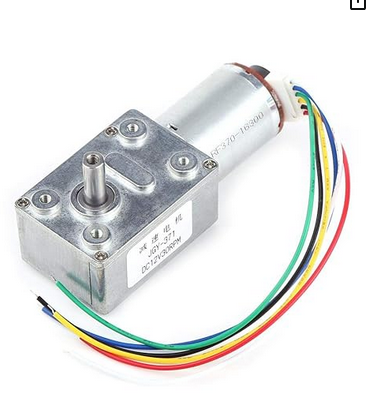 | DC Motors with encoders | 2 | 21.5 | 43 | <a href="https://www.amazon.es/turbina-schneckengetriebemotor-Encoder-Incluso-Bloqueo/dp/B07J2J2NGB?th=1" target="_blank"> Amazon </a> |
| 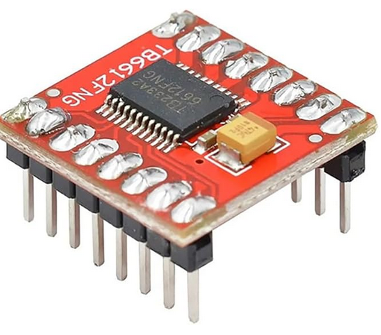 | DC Motor Driver TB6612FNG| 1 | 1.25 | 1.25 | <a href="https://www.amazon.es/iHaospace-TB6612FNG-Stepper-Driver-Controller/dp/B0CQCMPYXJ/ref=sr_1_9?crid=2238Z07IMNS2Y&dib=eyJ2IjoiMSJ9.bl8QzpK64-r9BHY5BXKGndJkJgLF4ncvXlspE97kyxte_AdVC2_9XdOx7k4Ofs3wpxXpH1sWz3pahm-vducOKA0D0LFq9IrKZ1j0LRE7RlGNsF_6KEi78q9GZ5h4ikZn7Ep5W618iSpSoz0RCr3UUMKAvOfS0ydquAK8cImO5sm79gmIKRZbxKkRy01W7zsQu5noLB9hncn8Ia4jkeWKv_hzEMEVuFDc7ITtOUuHB2soRChvaicDfTknJ_jDZY0y6YsGWDUkgRQDzjIhXOm0oAbBw5BNiZfQAW1blOuZhRA.R5Z2O0Fsuo6WiWcTkTtLi4y8AH-paai63pfjDRY9M9w&dib_tag=se&keywords=TB6612FNG&qid=1771955411&sprefix=tb6612fng%2Caps%2C273&sr=8-9" target="_blank"> Amazon </a> |
| 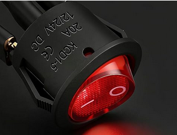 | Switch | 1 | 1.3 | 1.3 | <a href="https://www.amazon.es/Heschen-SPST-Interruptor-basculante-terminales/dp/B07G22DZ2N/ref=sr_1_27?crid=1FCJO9JXWU9NR&dib=eyJ2IjoiMSJ9.NeWQf-X7cYFzuTmMJIFDGEI6a42rokm1dHIcMqOXxv3chSxxo8A3Vx3ZyMdoAjNBPVKwq81VHSwli0omG94UdVZvxNSaQfLntRQ9dAU_-TPAtkj8XGtZHapi5Iw4_jwAa_GZmYkKeu898nxgENghuRDQrPrBq6MXv6DDXHxKBCuOHQomwpExTub1jPaPCAPPQICANmKvddKG-FUmvUfjh0r_c4OM0By1TObJCxYnSskrafgjKpd30745qZlzO7hl5fE0CQWFIeBXdoWrPDv279r0kIQHlWEp0OEqWQ1WVBc.thJsWGqFnyQPJbyoa3HWStFVKz70mndq8U9xPoES1bI&dib_tag=se&keywords=interruptor+24v&qid=1772116477&sprefix=interruptor+24%2Caps%2C318&sr=8-27" target="_blank"> Amazon </a> |
| 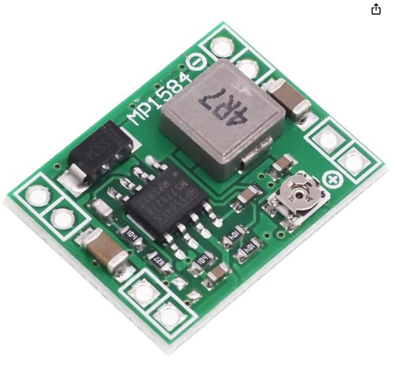 | Current regulator MP1584EN | 2 | 1.25 | 2.5 | <a href="https://www.amazon.es/HENGBIRD-buck-converter/dp/B0GYX25J36/ref=sr_1_1_sspa?crid=29NVJRWY5VQOP&dib=eyJ2IjoiMSJ9.tuyAwk8YwTUIwyOg5jl6ScuigtLUZgHKn1Offa1kHoexNsw564U8tMaaqlVxzcPNYzzMWBFQeeE-PckXRH9Xk6-YTE7o2C3KdDR7YltJD3V7R2yVKSnzetfxfIXtQl6W80s-cjxzhqmjfpTSX3Y-wsjg_-EJHX4q4g4RDwoBAAK6JH0cRRf0r5JZGHTwnS8rBdkOfisxVcWq1pB3NNVeVpWRx43qrns2mq4NgvFnO_UpjTs4boonYsGSJuuPYKAXLQUtJz9NW5lUUy4kDzr5rLNq32INH7bKhjdUr7WYFsc.JLp_DimnkzXAbJTX5Hep4O9PbPJ4_W5EGV4LBYrV-OA&dib_tag=se&keywords=mp1584en&qid=1780857165&sprefix=mp1584en%2Caps%2C120&sr=8-1-spons&aref=RCXQt8m1V9&sp_csd=d2lkZ2V0TmFtZT1zcF9hdGY&psc=1" target="_blank"> Amazon </a> |
| 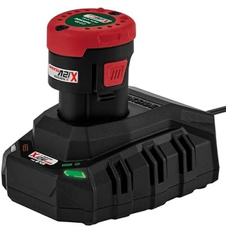 | 12V Drill battery | 2 | 20.99 | 41.98 | <a href="https://www.amazon.es/Bater%C3%ADa-extra-para-herramientas-familia/dp/B07SGPYZDK/ref=sr_1_6?crid=2SCLM2SU4E5UD&dib=eyJ2IjoiMSJ9.kpvKMCWbLuf1KAzuGV-dExn5D8eDXhPBy2eArk1ImWMJPHMHJBy2Xzs5gtAgjAB3UQVijU-mMdvjI-o2bKT5qLeNTq_DBW5Vrmkr82X9nH60aYwu1wTlfJp47fBArySjrXfyvtoXKv0sjqiWd-gUMhZt3GpI8PzY7XqureAfLhBBXfDsKOy1L4P0h6CHB0l4oZAUhIgZzRV2w__0QXYZ866ftBn7VYx6ePTbzql4yrKJ4nv1StM8PIBTlHapRcu1VKDz90Ok695FZUjN4cq11ozsf6nHvrPOlUMvvreRx7I.YoepWeluRTOfNb0xADxaVV493mron5g-4EFbnWw3um8&dib_tag=se&keywords=bateria+taladro+12v&qid=1771956734&sprefix=bateria+taladro+12v%2Caps%2C262&sr=8-6" target="_blank"> Amazon </a> |
| 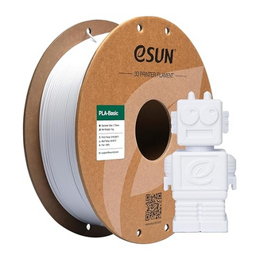 | 1Kg PLA | 1 | 11.72 | 11.72 | <a href="https://www.amazon.es/-/en/eSUN-Filament-Dimensional-Accuracy-Printers/dp/B0CR1DBBFM/ref=sr_1_4?crid=1USAOYCZBPQW&dib=eyJ2IjoiMSJ9.uaBXXX7IqKIt_jG7I0MvFw26uTZ_MNHML-agt4i59q-_Qj0ACdzKBGo0MJbwR_xIt4L-MZao-xcaUeOxQdPBFQGfVlPXx9onrC0fjm3vouVEvEfZH5uut04kjqlM_-lXdp5dihrglSrjDmuumQhwYl7OIy-zG5WYkQjbMEbZUDgeprSmTas1QxEwKDFulrp5UbbLpmHXFMWnpNdAJs_rU1IsMBDur7ANN2R-bOgvqLiYxAp3bKBfk09tZqvv-TrQx56MWtckFYlklQMPB3v7kpIUuoJCPqY1PbqY81GLIZ0.JAjQEZUTwsdTnn8AgNtTt9VOv_6K5rUbXjxeTtPK6K0&dib_tag=se&keywords=PLA&qid=1780858014&s=industrial&sprefix=pla%2Cindustrial%2C143&sr=1-4&th=1" target="_blank"> Amazon </a> |
| 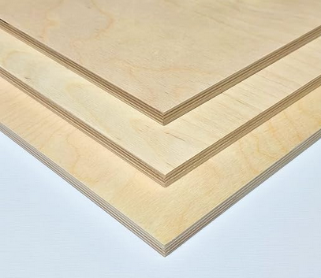 | 50x50cm Wooden plank | 1 | 16.26 | 16.26 | <a href="https://www.amazon.es/-/en/AtHaus%C2%AE-Plywood-Multiplex-Boards-Available/dp/B0DF2N84ZW/ref=sr_1_1?crid=3U2YMMADYJNYD&dib=eyJ2IjoiMSJ9.gYplVy7SP6R87GYojnH8cmlr-CQek2TbaXHD6F09se1PVNIRLarXLeu7OX7IO8uo9DLsoxsThlKbf2s6feF-5CCfIN_4ovH3cSCjX1DdfwpuhgbhQ7WIgacj4R_5mAHuALDZdY5j0sivWoT2s7Y8GG4KJWohmN1PpaJ9_5B6LC9oCjOeT-a0Ifi5RKVV7pB5JLP8cw5HhrtGuyagkoVMKG68AoO0moxtpGTLpUYWKyBBt_uUQ8UzlvS41HM2rLnXwoRQCinnHeGWYrQCTXI2yjB2kuaU_eCumfKgrgP0stA.bVQezRh0uY8izB7YQ_M58H5LKluOo6fUji7_EK-KjsI&dib_tag=se&keywords=madera%2B50x50&qid=1780855396&sprefix=madera%2B50x50%2Caps%2C98&sr=8-1&th=1" target="_blank"> Amazon </a> |
| 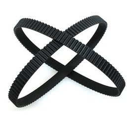 | Timing belt | 2 | 5.33 | 10.66 | <a href="https://www.amazon.es/dp/B0CQQXWH6B?th=1" target="_blank"> Amazon </a> |
| 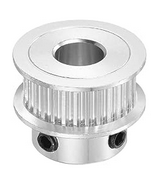 | Belt pulley | 2 | 5.25 | 10.49 | <a href="https://www.amazon.es/QUARKZMAN-Dentada-Temporizaci%C3%B3n-Aluminio-Hexagonal/dp/B0DRBM9TG1" target="_blank"> Amazon </a> |
| 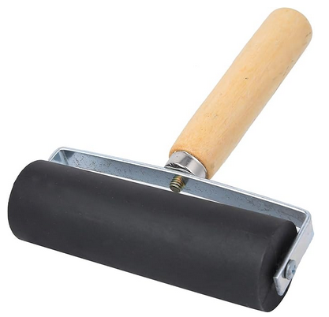 | Hard rubber roller | 1 | 11.41 | 11.41 | <a href="https://www.amazon.es/dp/B0D7CWNKWM" target="_blank"> Amazon </a> |
| | | | **Total cost** | **251.62** | |

## 🧾 Software Dependencies
<ul>
  <li><b>Operating System:</b> Ubuntu 22.04 LTS (Jammy Jellyfish).</li>
  <li><b>Robotics Framework:</b> ROS 2 Humble.</li>
  <li><b>Firmware IDE:</b> Visual Studio Code with the <b>PlatformIO</b> extension.</li>
  <li><b>Languages:</b> C++ and Python 3.10</li>
  <li><b>Networking:</b> Eclipse Zenoh (Router v1.8.0 is included directly in the repository).</li>
</ul>

<blockquote>
  
<b>💡 Note:</b> You do not need to install the ROS 2 or Python packages manually. Running the <code>setup_env.sh</code> script will automatically parse the <code>package.xml</code> files and fetch all required dependencies via <code>rosdep</code>.

</blockquote>

## 🏗️ Hardware Assembly (DIY Guide)

## 💻 Software & Firmware Setup

This repository is structured to make the initial setup fast and automated. The codebase is divided into three main environments: the high-level robot layer (ROS 2), the microcontroller firmware (ESP32), and the web app interface.

### ROS 2 Environment and UDEV Rules (Linux)

At the root of the project, you will find an automation script (<code>setup_env.sh</code>). This script automatically downloads the missing ROS 2 dependencies using <code>rosdep</code> and installs the system's UDEV rules (strictly necessary to assign the fixed ports <code>/dev/lidar</code> and <code>/dev/esp32</code>).

Open a terminal at the root of the project and run:

<pre><code>chmod +x setup_env.sh
./setup_env.sh</code></pre>

Once the script finishes successfully, build the ROS 2 workspace to generate the binaries and source the installation:

<pre><code>cd robot_coding/ros2_ws
colcon build</code>
source install/setup.bash</code></pre>

### Microcontroller Firmware (ESP32)

The low-level code is fully managed with PlatformIO, so there is no need to manually search for or install C++ libraries.

<ol>
  <li>Open the <code>robot_coding/firmware</code> folder using Visual Studio Code (requires having the official PlatformIO extension installed).</li>
  <li>Upon opening the project, PlatformIO will read the configuration and automatically download all necessary dependencies in the background (PID management, Zenoh bridge, motor libraries, etc.).</li>
  <li>Connect the ESP32 board to your PC via USB and use the <b>Upload</b> button on the bottom bar of PlatformIO to build and flash the code onto the microcontroller.</li>
</ol>

### App Web Interface

## 🚀 How to Run (Usage)

Once the initial setup and firmware flashing are complete, you can start the entire robot ecosystem by following these steps.

### Start the Robot Core (ROS 2)

Ensure your ESP32 and LiDAR are connected via USB. Open a terminal, source your workspace, and execute the main launch file. This single command orchestrates all the nodes and the zenoh router:

<pre><code>cd robot_coding/ros2_ws
source install/setup.bash
ros2 launch robot_bringup robot_core.launch.py</code></pre>

You should see the terminal output confirming that the LiDAR communication is normal and the Zenoh router is successfully connected to the microcontroller.

### Shutdown

To safely stop the robot, simply press <code>Ctrl + C</code> in the terminal running the ROS 2 launch file. The system will automatically shut down all nodes, stop the motors, and close the Zenoh connections.

## <picture></picture> Development Status
### 🚩Current Phase: Finished🚩

The vast majority of the objectives proposed at the beginning of the project have been successfully achieved, delivering a structured and functional robotic ecosystem. However, to maintain transparent documentation, the following points should be considered for future iterations:

### 🛠️ Hardware Limitations (Known Issues)
<ul>
  <li><b>Rear wheel fastening:</b> There is a mechanical design flaw that causes one of the rear wheels to unscrew during continuous turns. It is highly recommended that the client or the mechanical team redesign the fastening system (e.g., by adding nylon locknuts or using reverse threading) for the next prototype.</li>
</ul>

### 🚀 Future Work & Improvements (Roadmap)

Due to time constraints, the drift correction system—which was intended to fuse raw odometry, IMU data, and LiDAR triangulation with beacons using an <b>Extended Kalman Filter (EKF)</b>—was not implemented.

<b>Why is this not a blocker?</b> 
This omission does not affect the client's final scope. The current triangulation system was designed exclusively for the <b>indoor</b> prototype. The final product version will require a complete architectural shift regardless, in order to integrate <b>outdoor</b> positioning systems (such as GPS/RTK).

<blockquote>
  
<b>⚠️ Technical Note for Future Developers:</b> 
  Once the project is resumed and the Kalman Filter (EKF) is implemented to correct the drift, it is vital to update the subscriptions within the <code>controller_node</code>. Currently, the control logic relies on raw odometry. This must be updated so the node subscribes to the newly filtered odometry topic (typically <code>/odometry/filtered</code>).

</blockquote>

##  Team

- Project Manager – Oriol Arbonies  
- Mechanical Lead – Àlex López  
- Electronics Lead – Joan Marc Tur  
- Software Lead – Dídac Fernández ->  

